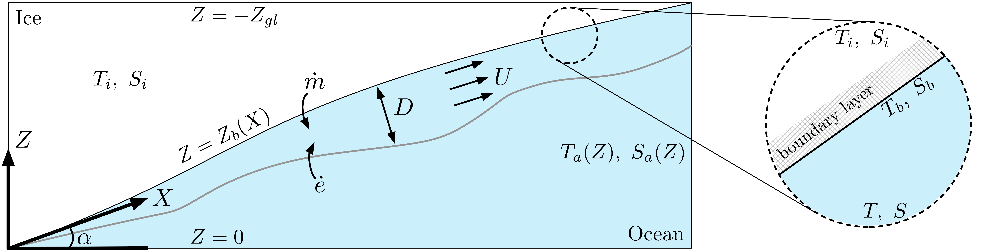

# Oceans Schematics

#### Subglacial Plumes


From *Asymptotic Analysis of Subglacial Plumes in Stratified Environments* by Bradley et al. (2022)\
doi: [10.1098/rspa.2021.0846](https://doi.org/10.1098/rspa.2021.0846)
```@raw html

```


**Download**: [png](../../../assets/oceans/Bradley_plume/Bradley_plume.png), [pdf](../../../assets/oceans/Bradley_plume/Bradley_plume.pdf), [SVG](../../../assets/oceans/Bradley_plume/Bradley_plume.svg), [IDRAW](../../../assets/oceans/Bradley_plume/Bradley_plume.idraw)\
**Cite**: adapted from Bradley, A. T., Rosie Williams, C., Jenkins, A., & Arthern, R. (2022). Asymptotic analysis of subglacial plumes in stratified environments. Proceedings of the Royal Society A, 478(2259), 20210846.\
**Tags**: subglacial plume, boundary layer, ice shelf cavity, buoyancy, modelling